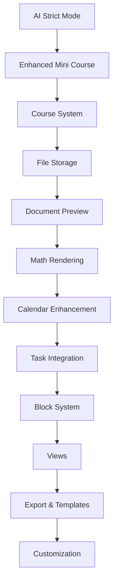

# 📊 KALA Enhancement - Quick Reference

## Project Stats
- **Total Tasks:** 138
- **P0 (Critical):** 47 tasks
- **P1 (High):** 42 tasks
- **P2 (Medium):** 35 tasks
- **P3 (Low):** 14 tasks
- **Estimated Total Effort:** ~350 hours
- **Sprints:** 6 sprints (12 weeks)

---

## Current Gaps Identified

### 🔴 Critical Gaps (P0)
| Gap | Current State | Required State |
|-----|---------------|----------------|
| **AI Strict Mode** | `strictNoAnswers` not enforced | AI never gives direct answers |
| **Mini Course Detail** | Basic structure | Multi-section with tasks |
| **File Storage** | Metadata only, files lost on refresh | Actual file persistence |
| **Document Preview** | Images only during upload | PDF, DOCX, full preview |
| **Math Rendering** | None | KaTeX for LaTeX formulas |
| **Course Organization** | None | Matakuliah-based organization |
| **Calendar Integration** | Basic milestone view | Full task-calendar sync |

### 🟠 Important Gaps (P1)
| Gap | Impact |
|-----|--------|
| Block-based editor | Limited content structuring |
| Database views (Kanban/Table) | Hard to visualize workload |
| Smart filtering | Can't find assignments quickly |
| File folders | No organization within storage |
| Progress aggregation | No per-course progress tracking |

### 🟡 Enhancement Gaps (P2)
| Gap | Benefit |
|-----|---------|
| Arabic/RTL support | Accessibility for Arabic users |
| PDF export | Offline study materials |
| Templates | Faster assignment setup |
| Advanced blocks | Rich academic content |
| Timeline view | Long-term planning |

---

## Technology Stack Additions Needed

### Backend Packages
```bash
# File handling
npm install multer @types/multer uuid

# PDF processing (optional)
npm install pdf-parse
```

### Frontend Packages
```bash
# PDF preview
npm install react-pdf @react-pdf-viewer/core @react-pdf-viewer/default-layout

# Math rendering
npm install katex @types/katex

# Rich text (for blocks)
npm install @tiptap/react @tiptap/starter-kit

# PDF export
npm install @react-pdf/renderer

# Word document preview
npm install mammoth

# Date handling for calendar
npm install date-fns
```

---

## Database Changes Summary

### New Tables
1. **courses** - Matakuliah organization
2. **folders** - File folder hierarchy
3. **calendar_events** - All calendar events
4. **blocks** - Block-based content (Phase 4)
5. **templates** - Academic templates (Phase 6)

### Modified Tables
1. **files** - Add folder_id, mime_type, thumbnail_key, user_id
2. **assignments** - Add course_id
3. **mini_courses** - Complete schema overhaul for sections/tasks
4. **user_settings** - Already has AI settings, just need to use them

---

## Key Files to Create

### Backend Services
```
backend/src/services/
├── courses.service.ts      (NEW)
├── folders.service.ts      (NEW)
├── files.service.ts        (NEW - actual storage)
├── calendar.service.ts     (NEW)
├── blocks.service.ts       (NEW - Phase 4)
└── templates.service.ts    (NEW - Phase 6)
```

### Backend Routes
```
backend/src/routes/
├── courses.routes.ts       (NEW)
├── folders.routes.ts       (NEW)
├── files.routes.ts         (NEW)
├── calendar.routes.ts      (NEW)
├── blocks.routes.ts        (NEW - Phase 4)
└── templates.routes.ts     (NEW - Phase 6)
```

### Frontend Components
```
components/
├── courses/
│   ├── CourseCard.tsx
│   ├── CourseManager.tsx
│   └── CourseSelector.tsx
├── storage/
│   ├── FileExplorer.tsx
│   ├── FolderTree.tsx
│   ├── FilePreviewModal.tsx
│   ├── PDFViewer.tsx
│   └── ImageViewer.tsx
├── calendar/
│   ├── CalendarView.tsx (enhance)
│   ├── CalendarEvent.tsx
│   ├── CalendarSidebar.tsx
│   └── EventModal.tsx
├── blocks/ (Phase 4)
│   ├── BlockEditor.tsx
│   ├── Block.tsx
│   └── blocks/
│       ├── TextBlock.tsx
│       ├── MathBlock.tsx
│       ├── ConceptBlock.tsx
│       └── ... (14 block types)
├── views/ (Phase 7)
│   ├── TableView.tsx
│   ├── KanbanView.tsx
│   ├── TimelineView.tsx
│   └── GalleryView.tsx
└── shared/
    ├── MathRenderer.tsx
    └── RichTextEditor.tsx
```

---

## Quick Commands

### Development
```bash
# Start frontend
npm run dev

# Start backend
cd backend && npm run dev

# Push database changes
cd backend && npx drizzle-kit push

# Type check
npm run type-check
```

### Package Installation
```bash
# All required packages at once (frontend)
npm install react-pdf @react-pdf-viewer/core @react-pdf-viewer/default-layout katex @types/katex @react-pdf/renderer mammoth date-fns

# Backend packages
cd backend && npm install multer @types/multer uuid
```

---

## Implementation Order



---

## Definition of Done

### For each feature:
- [ ] Backend API implemented and tested
- [ ] Frontend component implemented
- [ ] Integration with existing features verified
- [ ] Error handling implemented
- [ ] Loading states implemented
- [ ] Responsive design checked
- [ ] Dark mode verified
- [ ] Performance acceptable (<100ms typical operations)
- [ ] No console errors
- [ ] User-facing text is appropriate

### For AI features:
- [ ] AI never provides direct answers (test with trick questions)
- [ ] AI uses Socratic questioning
- [ ] AI respects user's thinkingMode setting
- [ ] AI respects user's hintLevel setting
- [ ] AI responds in user's preferred language

---

## Risk Factors

| Risk | Mitigation |
|------|------------|
| File storage size limits | Implement file size limits, consider cloud storage |
| AI prompt injection | Sanitize user input in prompts |
| Performance with many blocks | Virtualized rendering |
| Calendar event overload | Pagination, smart grouping |
| RTL complexity | Test extensively with Arabic text |

---

## Success Metrics

| Metric | Target |
|--------|--------|
| Page load time | < 2 seconds |
| AI response time | < 5 seconds |
| File upload speed | < 3 seconds for 5MB |
| User task completion | > 90% success rate |
| Mobile usability | All features accessible |

---

## Documentation Files

| File | Purpose |
|------|---------|
| `.agent/workflows/kala-enhancement.md` | Development workflow |
| `.agent/tasks.md` | Task breakdown |
| `.agent/reference.md` | This quick reference |
| `README.md` | Project overview |
| `docs/API.md` | API documentation (create) |
| `docs/ARCHITECTURE.md` | System architecture (create) |
