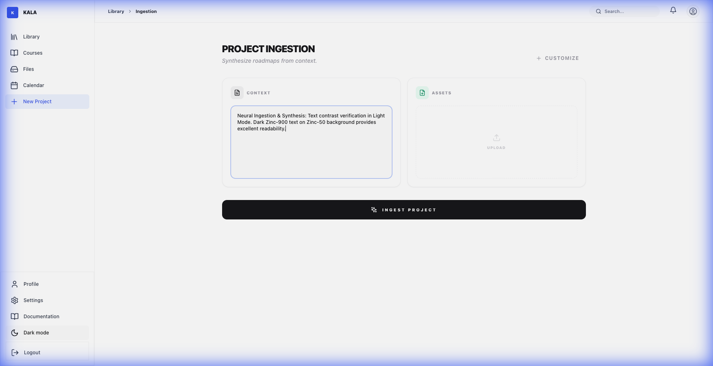

<div align="center">


# ✦ KALA 
### Sistem Operasi Kecerdasan Akademik

**"Melampaui produktivitas tradisional. KALA menyintesis kekacauan akademik menjadi kejelasan kognitif."**

*Satu Ruang Kerja Terpadu. Tanpa Hambatan. Dibangun untuk Akademisi Modern.*

<br/>

[](https://kala-edu.vercel.app)
[](LICENSE)
[](https://supabase.com/)

<br/>

**🌐 Bahasa Lain:** [🇬🇧 English](README.md)

</div>

## 🌌 Visi Kami

Pendidikan telah menjadi pertempuran logistik, bukan lagi perjalanan pembelajaran. Kita menghabiskan lebih banyak waktu untuk mengelola dokumen daripada menguasai konsep. **KALA** lahir untuk mengubah paradigma ini.

Dengan menggabungkan **metode pedagogi Sokratik** dengan **Ingesti Neural Tingkat Lanjut**, KALA menciptakan lingkungan dinamis di mana tugas-tugas Anda bukan sekadar tenggat waktu—melainkan jalur pembelajaran interaktif. Tidak ada lagi pembacaan pasif; hanya penguasaan aktif.

---

## 🎭 Showcase Fitur Sinematik

### 01. Perpustakaan Kognitif (Zen Mode)
Ruang kerja fidelitas tinggi yang dirancang untuk fokus mendalam. Seluruh kecepatan akademik Anda divisualisasikan dengan indah. Lacak tingkat penguasaan, tenggat waktu mendatang, dan "Daily Synapse" Anda dalam antarmuka yang bersih.

<div align="center">
  
  
  <p><i>Library: Menyeimbangkan kepadatan informasi dengan kejelasan visual (Terang & Gelap).</i></p>
</div>

### 02. Neural Ingestion & Synthesis
Hentikan entri data manual. Berikan KALA Silabus yang kompleks, PDF yang berantakan, atau foto catatan tangan Anda. Mesin neural kami mengekstrak konteks secara instan. Kini dioptimalkan sepenuhnya untuk **Visibilitas Kontras Tinggi** di kedua mode.

<div align="center">
  
  
  <p><i>Project Ingestion: Menyintesis peta jalan dengan keterbacaan fidelitas tinggi (Terang & Gelap).</i></p>
</div>

### 03. Jadwal Strategis & Penguasaan Kursus
Visualisasikan perjalanan akademik Anda dengan **Kalender** terintegrasi dan kelola **Kursus** Anda dengan presisi tinggi. Setiap tampilan dibangun untuk performa dan kejelasan.

<div align="center">
  
  
  <p><i>Calendar & Course Manager: Menguasai logistik pembelajaran dengan gaya.</i></p>
</div>

### 04. Socratic Sparring (Mentor AI)
Terintegrasi dengan **Gemini 1.5 Pro** dan **Grok-1**, KALA tidak sekadar memberikan jawaban. Ia melibatkan Anda dalam debat kritis, menantang asumsi Anda, dan memastikan pemahaman sejati melalui inkuiri dialektis.

---

## ✨ Pilar Inti

| Pilar | Filosofi | Implementasi |
| :--- | :--- | :--- |
| **Sintesis** | Konteks adalah segalanya. | Parsing dokumen berbasis AI untuk dokumen akademik kompleks. |
| **Kognisi** | Belajar, bukan sekadar selesai. | Mini-Course Otomatis & Kuis Diagnostik. |
| **Akselerasi** | Momentum melampaui aktivitas. | Milestone Cerdas & Pelacakan Progress Real-time. |
| **Penguasaan** | Bukti melalui debat. | Socratic Sparring & Penilaian Validasi Neural. |

---

## 🛠️ Arsitektur Berbasis Performa

KALA dibangun di atas tumpukan teknologi cloud profesional yang dirancang untuk skalabilitas tak terbatas:

*   **Frontend**: Next.js 15 (App Router) + Framer Motion 12
*   **Styling**: Tailwind CSS 4.0 (Modern CSS Directives)
*   **Database**: **Supabase (PostgreSQL)** dengan `pgvector` untuk pencarian cerebral
*   **ORM**: Drizzle ORM untuk kueri neural yang aman (type-safe)
*   **AI Orchestration**: Multi-model routing (Gemini Flash untuk Analisis, Grok untuk Penalaran)
*   **Auth**: Supabase Auth + Integrasi hybrid Passport.js

---

## 🚀 Peluncuran Cepat

### 1. Clone & Instalasi
```bash
git clone https://github.com/haysan/kala.git
cd kala
npm install
```

### 2. Konfigurasi Lingkungan
Buat file `.env.local` dengan konfigurasi berikut:
```env
NEXT_PUBLIC_SUPABASE_URL=url_supabase_anda
NEXT_PUBLIC_SUPABASE_ANON_KEY=anon_key_anda
DATABASE_URL=string_koneksi_postgresql_anda
GEMINI_API_KEY=key_gemini_anda
GROK_API_KEY=key_grok_anda
```

### 3. Inisialisasi Kecerdasan
```bash
npm run dev
```

---

## 💬 Mendapatkan Bantuan

| Metode | Link | Untuk |
|--------|------|-------|
| 🐛 **GitHub Issues** | [Buka Issue](https://github.com/haysan/kala/issues) | Laporan bug, permintaan fitur |
| 💬 **Discussions** | [GitHub Discussions](https://github.com/haysan/kala/discussions) | Pertanyaan, diskusi |
| 📧 **Email** | haysan@example.com | Pertanyaan sensitif |

---

## 🙏 Terima Kasih

Terima kasih kepada semua yang telah berkontribusi pada proyek ini:

- [Google Gemini](https://ai.google.dev/) - AI capabilities
- [xAI Grok](https://x.ai/) - Creative AI features
- [Supabase](https://supabase.com/) - Cloud database & auth
- [Lucide Icons](https://lucide.dev/) - Beautiful icons
- [Framer Motion](https://www.framer.com/motion/) - Smooth animations
- Semua kontributor yang luar biasa!

---

<div align="center">

### ⭐ Beri bintang repo ini jika bermanfaat!

---

**Dibuat dengan ❤️ untuk Mahasiswa Indonesia dan Seluruh Dunia**

*Transformasikan perjalanan akademik Anda dengan KALA*

---

**[🔝 Kembali ke Atas](#-kala)**

</div>
