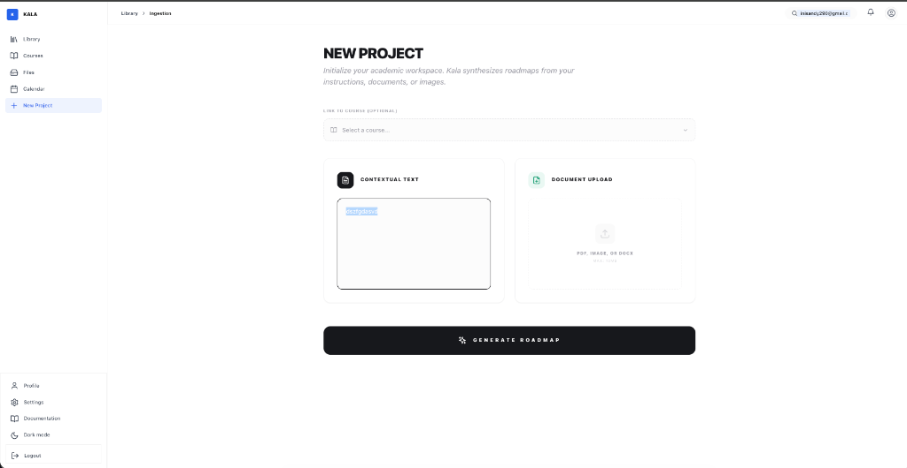
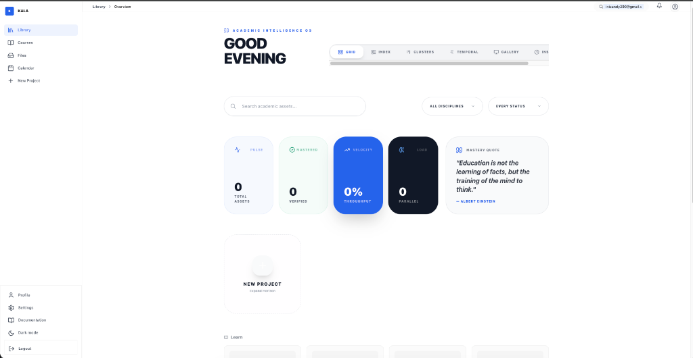

<div align="center">


# ✦ KALA 
### The Academic Intelligence Operating System

**Transcending traditional productivity. KALA synthesizes academic chaos into cognitive clarity.**

*One Unified Workspace. Zero Friction. Built for the Modern Scholar.*

<br/>

[](https://kala-edu.vercel.app)
[](LICENSE)

<br/>

[](https://nextjs.org/)
[](https://www.typescriptlang.org/)
[](https://orm.drizzle.team/)
[](https://supabase.com/)
[](https://tailwindcss.com/)

---

</div>

## 🌌 The Vision

Education has become a battle of logistics, not a journey of learning. We spend more time Managing documents than mastering concepts. **KALA** was born to change this.

By merging **Socratic pedagogical methods** with **Advanced Neural Ingestion**, KALA creates a dynamic environment where your assignments aren't just deadlines—they are interactive learning pathways.

---

## 🎭 Cinematic Feature Showcase

### 01. Neural Ingestion & Synthesis
Stop manual data entry. Feed KALA a complex Syllabus, a messy PDF, or even a photo of your notes.
<div align="center">
  
  <p><i>The Ingestion Engine: Turning raw context into structured intelligence.</i></p>
</div>

### 02. The Cognitive Dashboard
Your entire academic velocity, visualized. Track mastery levels, upcoming pulses, and your "Daily Synapse" in one high-fidelity interface.
<div align="center">
  
  <p><i>Command Center: Where focus meets execution.</i></p>
</div>

### 03. Socratic Sparring (AI Tutor)
Integrated with **Gemini 1.5 Pro** and **Grok-1**, KALA doesn't just give answers. It engages you in critical debates, challenges your assumptions, and ensures you *actually* understand the core concepts.

---

## ✨ Core Pillars

| Pillar | Philosophy | Implementation |
| :--- | :--- | :--- |
| **Synthesis** | Context is everything. | AI-powered parsing of complex academic documents. |
| **Cognition** | Learn, don't just finish. | Automated Mini-Courses & Diagnostic Quizzes. |
| **Velocity** | Momentum over activity. | Smart Milestones & Progress Tracking. |
| **Mastery** | Proof through debate. | Socratic Sparring & Neural Validation. |

---

## 🛠️ Performance-First Architecture

KALA is built on a high-performance cloud stack designed for infinite scalability and neural context:

*   **Frontend**: Next.js 15 (App Router) + Tailwind CSS 4.0
*   **Database**: Supabase (PostgreSQL) with pgvector for cerebral search
*   **ORM**: Drizzle ORM for type-safe neural queries
*   **AI Orchestration**: Multi-model routing (Gemini for Analysis, Grok for Reasoning)
*   **Auth**: Supabase Auth + Secure JWT integration

---

## 🚀 Rapid Launch

### Install & Configure

```bash
# Clone the intelligence
git clone https://github.com/haysan/kala.git
cd kala

# Initialize dependencies
npm install

# Configure Environment
cp .env.example .env.local
# Add your AI Keys and Supabase credentials
```

### Development
```bash
npm run dev
```

---

## 📖 Extended Documentation

*   [**Features Deep Dive**](docs/FEATURES.md) - Explore the mechanics of KALA.
*   [**Technical Architecture**](docs/BACKEND_DATABASE_DESIGN.md) - Database schema and AI routing logic.
*   [**Contributing Guide**](CONTRIBUTING.md) - Join the mission to reshape education.
*   [**API Reference**](docs/API_DOCUMENTATION.md) - For developers building on top of KALA.

---

## 🤝 Contributing

We are an open-source project building the future of education. Your contributions—whether code, design, or documentation—are vital.

1.  **Fork** the repository
2.  **Clone** your fork
3.  Implement your changes in a **feature branch**
4.  Submit a **Pull Request**

---

## 📄 License & Legal

Distributed under the **MIT License**. See `LICENSE` for more information.

<div align="center">

<br/>

**Built with 🧠 for students who refuse to settle for "good enough".**

[🔝 Back to Top](#-kala)

</div>
