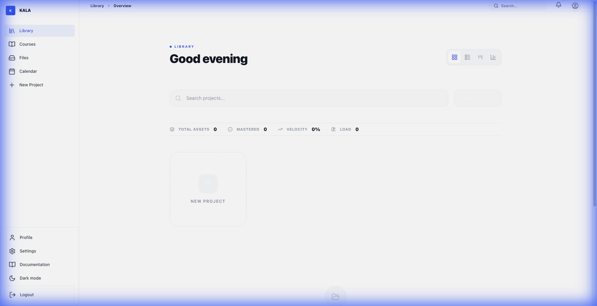
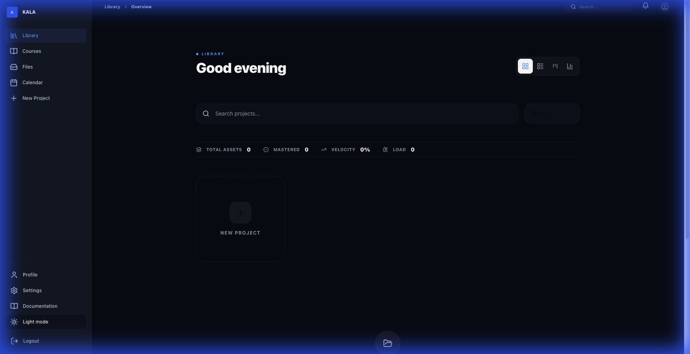
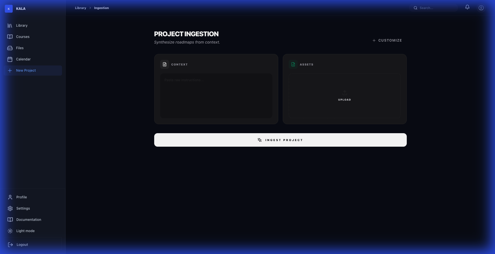
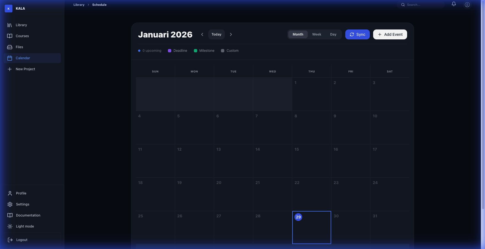
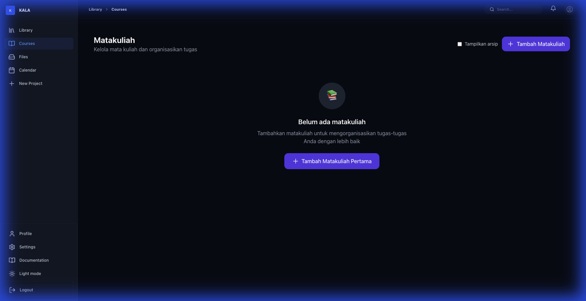

<div align="center">


# ✦ KALA 
### The Academic Intelligence Operating System

**"Transcending traditional productivity. KALA synthesizes academic chaos into cognitive clarity."**

*One Unified Workspace. Zero Friction. Built for the Modern Scholar.*

<br/>

[](https://kala-edu.vercel.app)
[](LICENSE)
[](https://supabase.com/)

<br/>

</div>

## 🌌 The Vision

Education has become a battle of logistics, not a journey of learning. We spend more time managing documents than mastering concepts. **KALA** was born to change this.

By merging **Socratic pedagogical methods** with **Advanced Neural Ingestion**, KALA creates a dynamic environment where your assignments aren't just deadlines—they are interactive learning pathways. No more passive reading; only active mastery.

---

## 🎭 Cinematic Feature Showcase

### 01. The Cognitive Library (Zen Mode)
A high-fidelity workspace designed for deep focus. Your entire academic velocity, visualized. Track mastery levels, upcoming pulses, and your "Daily Synapse" in a clean interface that respects your attention.

<div align="center">
  
  
  <p><i>Library: Balancing information density with visual clarity (Light & Dark).</i></p>
</div>

### 02. Neural Ingestion & Synthesis
Stop manual data entry. Feed KALA a complex Syllabus, a messy PDF, or a photo of your handwritten notes. Our neural engine extracts context, deadlines, and core concepts instantly. Now fully optimized for **Dark Mode** with high-legibility contrast.

<div align="center">
  
  <p><i>Project Ingestion: Seamlessly synthesizing roadmaps from raw context.</i></p>
</div>

### 03. Strategic Scheduling & Course Mastery
Visualize your academic journey with the integrated **Calendar** and manage your **Courses** with precision. Every view is built for performance and clarity.

<div align="center">
  
  
  <p><i>Calendar & Course Manager: Mastering the logistics of learning.</i></p>
</div>

### 04. Socratic Sparring (AI Tutor)
Integrated with **Gemini 1.5 Pro** and **Grok-1**, KALA doesn't just give answers. It engages you in critical debates, challenges your assumptions, and ensures you *actually* understand the core concepts through dialectical inquiry.

---

## ✨ Core Pillars

| Pillar | Philosophy | Implementation |
| :--- | :--- | :--- |
| **Synthesis** | Context is everything. | AI-powered parsing of complex academic documents. |
| **Cognition** | Learn, don't just finish. | Automated Mini-Courses & Diagnostic Quizzes. |
| **Velocity** | Momentum over activity. | Smart Milestones & Real-time Progress Tracking. |
| **Mastery** | Proof through debate. | Socratic Sparring & Neural Validation Assessment. |

---

## 🛠️ Performance-First Architecture

KALA is built on a professional cloud stack designed for infinite scalability and neural context:

*   **Frontend**: Next.js 15 (App Router) + Framer Motion 12
*   **Styling**: Tailwind CSS 4.0 (Modern CSS Directives)
*   **Database**: **Supabase (PostgreSQL)** with `pgvector` for cerebral search
*   **ORM**: Drizzle ORM for type-safe neural queries
*   **AI Orchestration**: Multi-model routing (Gemini Flash for Analysis, Grok for Reasoning)
*   **Auth**: Supabase Auth + Passport.js hybrid integration

---

## 🚀 Rapid Launch

### 1. Clone & Install
```bash
git clone https://github.com/haysan/kala.git
cd kala
npm install
```

### 2. Configure Environment
Create a `.env.local` file with the following:
```env
NEXT_PUBLIC_SUPABASE_URL=your_supabase_url
NEXT_PUBLIC_SUPABASE_ANON_KEY=your_anon_key
DATABASE_URL=your_postgresql_connection_string
GEMINI_API_KEY=your_gemini_key
GROK_API_KEY=your_grok_key
```

### 3. Initialize Intelligence
```bash
npm run dev
```

---

## 📖 documentation path

*   [**Backend & DB Design**](docs/BACKEND_DATABASE_DESIGN.md) - Deep dive into Supabase schema.
*   [**Product Vision (PRD)**](docs/PRD.md) - The roadmap for KALA.
*   [**Implementation Checklist**](docs/IMPLEMENTATION_CHECKLIST.md) - Tracking our engineering progress.
*   [**Team Skills**](docs/skill.md) - Roles required for the KALA ecosystem.

---

## 🤝 Contributing

We are building the future of education. Your contributions—whether code, design, or documentation—are the fuel for this mission.

1.  **Fork** the repository.
2.  Implement your changes in a **feature branch**.
3.  Submit a **Pull Request** with a detailed explanation of your logic.

---

<div align="center">

**Built with 🧠 and ❤️ for students who refuse to settle for "good enough".**

[🔝 Back to Top](#-kala)

</div>
