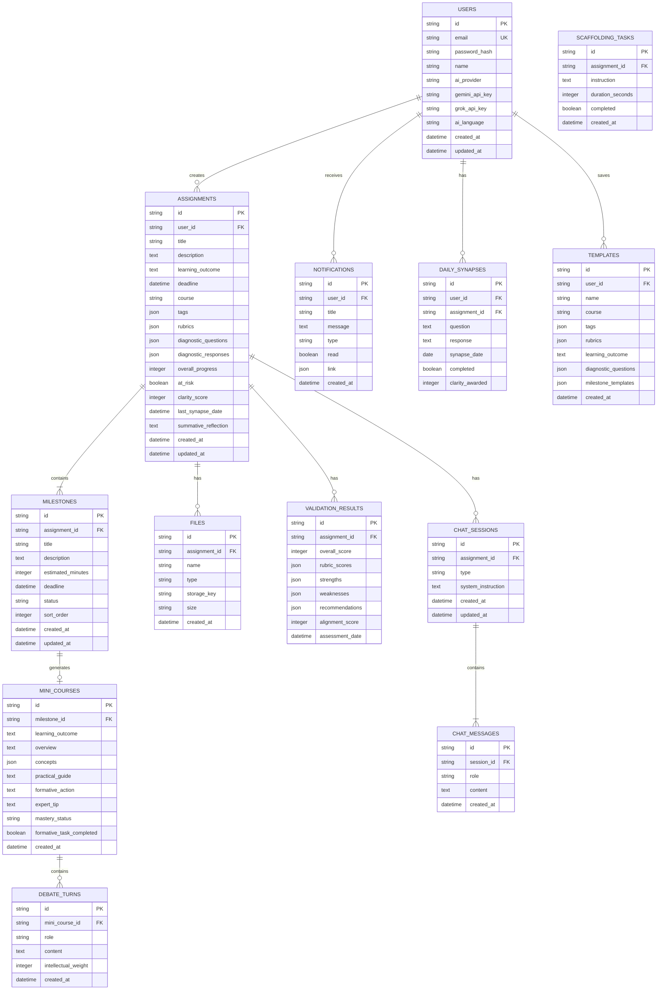

# Backend & Database Design Document
## Kala - Academic Intelligence OS

---

## 1. Arsitektur Backend

### 1.1 Technology Stack

| Component | Technology | Justification |
|-----------|------------|---------------|
| **Runtime** | Node.js 20+ | JavaScript ecosystem, async-first, AI library support |
| **Framework** | Express.js / Hono | Lightweight, middleware-based, easy to extend |
| **Database** | Turso (libSQL) | SQLite-compatible, edge-ready, serverless-friendly |
| **ORM** | Drizzle ORM | Type-safe, lightweight, great Turso support |
| **Authentication** | JWT + bcrypt | Stateless, secure, industry standard |
| **AI Provider** | Google Gemini API | Already integrated in frontend, multimodal support |
| **File Storage** | Cloudflare R2 / S3 | Cost-effective, S3-compatible API |
| **Validation** | Zod | Runtime type validation, TypeScript-native |

### 1.2 Struktur Folder Backend

```
backend/
├── src/
│   ├── index.ts              # Entry point
│   ├── app.ts                # Express/Hono app setup
│   ├── config/
│   │   ├── database.ts       # Turso connection
│   │   ├── gemini.ts         # AI client config
│   │   └── env.ts            # Environment variables
│   ├── routes/
│   │   ├── auth.routes.ts
│   │   ├── assignments.routes.ts
│   │   ├── milestones.routes.ts
│   │   ├── ai.routes.ts
│   │   ├── files.routes.ts
│   │   └── index.ts
│   ├── controllers/
│   │   ├── auth.controller.ts
│   │   ├── assignments.controller.ts
│   │   ├── milestones.controller.ts
│   │   ├── ai.controller.ts
│   │   └── files.controller.ts
│   ├── services/
│   │   ├── auth.service.ts
│   │   ├── assignments.service.ts
│   │   ├── milestones.service.ts
│   │   ├── gemini.service.ts
│   │   ├── synapse.service.ts
│   │   └── validation.service.ts
│   ├── middleware/
│   │   ├── auth.middleware.ts
│   │   ├── error.middleware.ts
│   │   ├── validation.middleware.ts
│   │   └── rateLimit.middleware.ts
│   ├── db/
│   │   ├── schema.ts         # Drizzle schema
│   │   ├── migrations/
│   │   └── seed.ts
│   ├── types/
│   │   └── index.ts
│   └── utils/
│       ├── jwt.ts
│       ├── hash.ts
│       └── helpers.ts
├── drizzle.config.ts
├── package.json
└── tsconfig.json
```

---

## 2. Database Design (Turso/libSQL)

### 2.1 Entity Relationship Diagram (ERD)



### 2.2 SQL Schema (DDL)

```sql
-- Users table
CREATE TABLE users (
    id TEXT PRIMARY KEY DEFAULT (lower(hex(randomblob(16)))),
    email TEXT UNIQUE NOT NULL,
    password_hash TEXT NOT NULL,
    name TEXT NOT NULL,
    ai_provider TEXT DEFAULT 'gemini',
    gemini_api_key TEXT,
    grok_api_key TEXT,
    ai_language TEXT DEFAULT 'en',
    created_at DATETIME DEFAULT CURRENT_TIMESTAMP,
    updated_at DATETIME DEFAULT CURRENT_TIMESTAMP
);

CREATE INDEX idx_users_email ON users(email);

-- Assignments table
CREATE TABLE assignments (
    id TEXT PRIMARY KEY DEFAULT (lower(hex(randomblob(16)))),
    user_id TEXT NOT NULL REFERENCES users(id) ON DELETE CASCADE,
    title TEXT NOT NULL,
    description TEXT,
    learning_outcome TEXT,
    deadline DATETIME,
    course TEXT DEFAULT 'General',
    tags TEXT DEFAULT '[]', -- JSON array
    rubrics TEXT DEFAULT '[]', -- JSON array
    diagnostic_questions TEXT DEFAULT '[]', -- JSON array
    diagnostic_responses TEXT DEFAULT '{}', -- JSON object
    overall_progress INTEGER DEFAULT 0,
    at_risk BOOLEAN DEFAULT FALSE,
    clarity_score INTEGER DEFAULT 0,
    last_synapse_date DATE,
    summative_reflection TEXT,
    created_at DATETIME DEFAULT CURRENT_TIMESTAMP,
    updated_at DATETIME DEFAULT CURRENT_TIMESTAMP
);

CREATE INDEX idx_assignments_user_id ON assignments(user_id);
CREATE INDEX idx_assignments_deadline ON assignments(deadline);
CREATE INDEX idx_assignments_course ON assignments(course);

-- Milestones table
CREATE TABLE milestones (
    id TEXT PRIMARY KEY DEFAULT (lower(hex(randomblob(16)))),
    assignment_id TEXT NOT NULL REFERENCES assignments(id) ON DELETE CASCADE,
    title TEXT NOT NULL,
    description TEXT,
    estimated_minutes INTEGER DEFAULT 30,
    deadline DATETIME,
    status TEXT DEFAULT 'todo' CHECK (status IN ('todo', 'in_progress', 'completed')),
    sort_order INTEGER DEFAULT 0,
    created_at DATETIME DEFAULT CURRENT_TIMESTAMP,
    updated_at DATETIME DEFAULT CURRENT_TIMESTAMP
);

CREATE INDEX idx_milestones_assignment_id ON milestones(assignment_id);
CREATE INDEX idx_milestones_status ON milestones(status);

-- Mini Courses table
CREATE TABLE mini_courses (
    id TEXT PRIMARY KEY DEFAULT (lower(hex(randomblob(16)))),
    milestone_id TEXT UNIQUE NOT NULL REFERENCES milestones(id) ON DELETE CASCADE,
    learning_outcome TEXT,
    overview TEXT,
    concepts TEXT DEFAULT '[]', -- JSON array
    practical_guide TEXT,
    formative_action TEXT,
    expert_tip TEXT,
    mastery_status TEXT DEFAULT 'untested' CHECK (mastery_status IN ('untested', 'refined', 'perfected')),
    formative_task_completed BOOLEAN DEFAULT FALSE,
    created_at DATETIME DEFAULT CURRENT_TIMESTAMP
);

CREATE INDEX idx_mini_courses_milestone_id ON mini_courses(milestone_id);

-- Debate Turns table
CREATE TABLE debate_turns (
    id TEXT PRIMARY KEY DEFAULT (lower(hex(randomblob(16)))),
    mini_course_id TEXT NOT NULL REFERENCES mini_courses(id) ON DELETE CASCADE,
    role TEXT NOT NULL CHECK (role IN ('user', 'model')),
    content TEXT NOT NULL,
    intellectual_weight INTEGER DEFAULT 0,
    created_at DATETIME DEFAULT CURRENT_TIMESTAMP
);

CREATE INDEX idx_debate_turns_mini_course_id ON debate_turns(mini_course_id);

-- Files table
CREATE TABLE files (
    id TEXT PRIMARY KEY DEFAULT (lower(hex(randomblob(16)))),
    assignment_id TEXT NOT NULL REFERENCES assignments(id) ON DELETE CASCADE,
    name TEXT NOT NULL,
    type TEXT DEFAULT 'draft' CHECK (type IN ('instruction', 'draft', 'final', 'feedback')),
    storage_key TEXT, -- S3/R2 key
    size TEXT,
    created_at DATETIME DEFAULT CURRENT_TIMESTAMP
);

CREATE INDEX idx_files_assignment_id ON files(assignment_id);

-- Validation Results table
CREATE TABLE validation_results (
    id TEXT PRIMARY KEY DEFAULT (lower(hex(randomblob(16)))),
    assignment_id TEXT NOT NULL REFERENCES assignments(id) ON DELETE CASCADE,
    overall_score INTEGER,
    rubric_scores TEXT DEFAULT '[]', -- JSON array
    strengths TEXT DEFAULT '[]', -- JSON array
    weaknesses TEXT DEFAULT '[]', -- JSON array
    recommendations TEXT DEFAULT '[]', -- JSON array
    alignment_score INTEGER,
    assessment_date DATETIME DEFAULT CURRENT_TIMESTAMP
);

CREATE INDEX idx_validation_results_assignment_id ON validation_results(assignment_id);

-- Chat Sessions table
CREATE TABLE chat_sessions (
    id TEXT PRIMARY KEY DEFAULT (lower(hex(randomblob(16)))),
    assignment_id TEXT NOT NULL REFERENCES assignments(id) ON DELETE CASCADE,
    type TEXT DEFAULT 'tutor' CHECK (type IN ('tutor', 'debate')),
    system_instruction TEXT,
    created_at DATETIME DEFAULT CURRENT_TIMESTAMP,
    updated_at DATETIME DEFAULT CURRENT_TIMESTAMP
);

CREATE INDEX idx_chat_sessions_assignment_id ON chat_sessions(assignment_id);

-- Chat Messages table
CREATE TABLE chat_messages (
    id TEXT PRIMARY KEY DEFAULT (lower(hex(randomblob(16)))),
    session_id TEXT NOT NULL REFERENCES chat_sessions(id) ON DELETE CASCADE,
    role TEXT NOT NULL CHECK (role IN ('user', 'model', 'system')),
    content TEXT NOT NULL,
    created_at DATETIME DEFAULT CURRENT_TIMESTAMP
);

CREATE INDEX idx_chat_messages_session_id ON chat_messages(session_id);

-- Daily Synapses table
CREATE TABLE daily_synapses (
    id TEXT PRIMARY KEY DEFAULT (lower(hex(randomblob(16)))),
    user_id TEXT NOT NULL REFERENCES users(id) ON DELETE CASCADE,
    assignment_id TEXT NOT NULL REFERENCES assignments(id) ON DELETE CASCADE,
    question TEXT NOT NULL,
    response TEXT,
    synapse_date DATE NOT NULL,
    completed BOOLEAN DEFAULT FALSE,
    clarity_awarded INTEGER DEFAULT 15,
    UNIQUE(user_id, synapse_date)
);

CREATE INDEX idx_daily_synapses_user_date ON daily_synapses(user_id, synapse_date);

-- Notifications table
CREATE TABLE notifications (
    id TEXT PRIMARY KEY DEFAULT (lower(hex(randomblob(16)))),
    user_id TEXT NOT NULL REFERENCES users(id) ON DELETE CASCADE,
    title TEXT NOT NULL,
    message TEXT,
    type TEXT DEFAULT 'system' CHECK (type IN ('deadline', 'risk', 'feedback', 'system')),
    read BOOLEAN DEFAULT FALSE,
    link TEXT, -- JSON object
    created_at DATETIME DEFAULT CURRENT_TIMESTAMP
);

CREATE INDEX idx_notifications_user_id ON notifications(user_id);
CREATE INDEX idx_notifications_read ON notifications(read);

-- Templates table
CREATE TABLE templates (
    id TEXT PRIMARY KEY DEFAULT (lower(hex(randomblob(16)))),
    user_id TEXT NOT NULL REFERENCES users(id) ON DELETE CASCADE,
    name TEXT NOT NULL,
    course TEXT,
    tags TEXT DEFAULT '[]', -- JSON array
    rubrics TEXT DEFAULT '[]', -- JSON array
    learning_outcome TEXT,
    diagnostic_questions TEXT DEFAULT '[]', -- JSON array
    milestone_templates TEXT DEFAULT '[]', -- JSON array
    created_at DATETIME DEFAULT CURRENT_TIMESTAMP
);

CREATE INDEX idx_templates_user_id ON templates(user_id);

-- Scaffolding Tasks table
CREATE TABLE scaffolding_tasks (
    id TEXT PRIMARY KEY DEFAULT (lower(hex(randomblob(16)))),
    assignment_id TEXT NOT NULL REFERENCES assignments(id) ON DELETE CASCADE,
    instruction TEXT NOT NULL,
    duration_seconds INTEGER DEFAULT 300,
    completed BOOLEAN DEFAULT FALSE,
    created_at DATETIME DEFAULT CURRENT_TIMESTAMP
);

CREATE INDEX idx_scaffolding_tasks_assignment_id ON scaffolding_tasks(assignment_id);
```

### 2.3 Contoh Query CRUD

```sql
-- CREATE: New Assignment
INSERT INTO assignments (user_id, title, description, learning_outcome, deadline, course, tags, rubrics)
VALUES (
    'user-uuid-here',
    'Ethics Essay',
    'Write a 2000-word essay on Kantian ethics',
    'Analyze and evaluate ethical frameworks',
    '2024-02-15 23:59:59',
    'Philosophy 101',
    '["ethics", "kant", "essay"]',
    '["Critical Analysis", "Proper Citations", "Clear Argumentation"]'
);

-- READ: Get all assignments for user with progress
SELECT 
    a.*,
    COUNT(m.id) as total_milestones,
    COUNT(CASE WHEN m.status = 'completed' THEN 1 END) as completed_milestones
FROM assignments a
LEFT JOIN milestones m ON a.id = m.assignment_id
WHERE a.user_id = 'user-uuid-here'
GROUP BY a.id
ORDER BY a.deadline ASC;

-- READ: Get assignment detail with milestones
SELECT 
    a.*,
    json_group_array(
        json_object(
            'id', m.id,
            'title', m.title,
            'status', m.status,
            'estimatedMinutes', m.estimated_minutes
        )
    ) as milestones
FROM assignments a
LEFT JOIN milestones m ON a.id = m.assignment_id
WHERE a.id = 'assignment-uuid'
GROUP BY a.id;

-- UPDATE: Toggle milestone status
UPDATE milestones 
SET 
    status = CASE WHEN status = 'completed' THEN 'todo' ELSE 'completed' END,
    updated_at = CURRENT_TIMESTAMP
WHERE id = 'milestone-uuid';

-- UPDATE: Recalculate assignment progress
UPDATE assignments
SET 
    overall_progress = (
        SELECT ROUND(
            (COUNT(CASE WHEN status = 'completed' THEN 1 END) * 100.0) / COUNT(*)
        )
        FROM milestones WHERE assignment_id = assignments.id
    ),
    updated_at = CURRENT_TIMESTAMP
WHERE id = 'assignment-uuid';

-- DELETE: Remove assignment (cascades to milestones, files, etc.)
DELETE FROM assignments WHERE id = 'assignment-uuid';

-- QUERY: Get at-risk assignments
SELECT * FROM assignments
WHERE at_risk = TRUE
  AND user_id = 'user-uuid'
  AND overall_progress < 50
  AND deadline < datetime('now', '+48 hours');

-- QUERY: Get today's synapse for user
SELECT * FROM daily_synapses
WHERE user_id = 'user-uuid'
  AND synapse_date = date('now');
```

---

## 3. API Endpoint Specification

### 3.1 Authentication Endpoints

| Method | Endpoint | Description | Auth |
|--------|----------|-------------|------|
| POST | `/api/auth/register` | Register new user | ❌ |
| POST | `/api/auth/login` | Login and get JWT | ❌ |
| POST | `/api/auth/logout` | Invalidate session | ✅ |
| GET | `/api/auth/me` | Get current user | ✅ |
| PUT | `/api/auth/profile` | Update profile | ✅ |

#### POST /api/auth/register
```typescript
// Request Body
{
  email: string;
  password: string;
  name: string;
}

// Response 201
{
  success: true;
  data: {
    id: string;
    email: string;
    name: string;
    token: string;
  }
}
```

#### POST /api/auth/login
```typescript
// Request Body
{
  email: string;
  password: string;
}

// Response 200
{
  success: true;
  data: {
    token: string;
    user: { id, email, name }
  }
}
```

---

### 3.2 Assignment Endpoints

| Method | Endpoint | Description | Auth |
|--------|----------|-------------|------|
| GET | `/api/assignments` | List all assignments | ✅ |
| GET | `/api/assignments/:id` | Get assignment detail | ✅ |
| POST | `/api/assignments` | Create assignment | ✅ |
| PUT | `/api/assignments/:id` | Update assignment | ✅ |
| DELETE | `/api/assignments/:id` | Delete assignment | ✅ |

#### GET /api/assignments
```typescript
// Query Params
{
  course?: string;
  atRisk?: boolean;
  sortBy?: 'deadline' | 'createdAt' | 'progress';
}

// Response 200
{
  success: true;
  data: Assignment[];
  meta: { total: number }
}
```

#### POST /api/assignments
```typescript
// Request Body
{
  title: string;
  description?: string;
  learningOutcome?: string;
  deadline: string; // ISO date
  course?: string;
  tags?: string[];
  rubrics?: string[];
  diagnosticQuestions?: string[];
  milestones?: {
    title: string;
    description: string;
    estimatedMinutes: number;
    deadline: string;
  }[];
}

// Response 201
{
  success: true;
  data: Assignment
}
```

---

### 3.3 Milestone Endpoints

| Method | Endpoint | Description | Auth |
|--------|----------|-------------|------|
| GET | `/api/assignments/:id/milestones` | List milestones | ✅ |
| POST | `/api/assignments/:id/milestones` | Add milestone | ✅ |
| PUT | `/api/milestones/:id` | Update milestone | ✅ |
| PUT | `/api/milestones/:id/toggle` | Toggle completion | ✅ |
| DELETE | `/api/milestones/:id` | Delete milestone | ✅ |

#### PUT /api/milestones/:id/toggle
```typescript
// Response 200
{
  success: true;
  data: {
    milestone: Milestone;
    assignmentProgress: number; // Updated progress
  }
}
```

---

### 3.4 AI Service Endpoints

| Method | Endpoint | Description | Auth |
|--------|----------|-------------|------|
| POST | `/api/ai/analyze-assignment` | AI analyze text/file | ✅ |
| POST | `/api/ai/generate-mini-course` | Generate mini-course | ✅ |
| POST | `/api/ai/generate-synapse` | Generate daily synapse | ✅ |
| POST | `/api/ai/generate-scaffold` | Generate scaffolding task | ✅ |
| POST | `/api/ai/generate-quiz` | Generate quiz questions | ✅ |
| POST | `/api/ai/validate-work` | Validate final work | ✅ |

#### POST /api/ai/analyze-assignment
```typescript
// Request Body (multipart/form-data)
{
  text?: string;
  file?: File; // PDF, DOCX, or Image
}

// Response 200
{
  success: true;
  data: {
    title: string;
    description: string;
    learningOutcome: string;
    diagnosticQuestions: string[];
    deadline: string;
    course: string;
    rubrics: string[];
    milestones: {
      title: string;
      description: string;
      estimatedMinutes: number;
      deadline: string;
    }[];
  }
}
```

#### POST /api/ai/generate-mini-course
```typescript
// Request Body
{
  milestoneId: string;
  milestoneTitle: string;
  milestoneDescription: string;
  assignmentContext: string;
  fullRoadmap?: string;
}

// Response 200
{
  success: true;
  data: MiniCourse
}
```

---

### 3.5 Chat Endpoints

| Method | Endpoint | Description | Auth |
|--------|----------|-------------|------|
| GET | `/api/assignments/:id/chat` | Get/create chat session | ✅ |
| POST | `/api/chat/:sessionId/message` | Send message | ✅ |
| GET | `/api/chat/:sessionId/history` | Get chat history | ✅ |

#### POST /api/chat/:sessionId/message
```typescript
// Request Body
{
  message: string;
}

// Response 200
{
  success: true;
  data: {
    userMessage: ChatMessage;
    aiResponse: ChatMessage;
  }
}
```

---

### 3.6 File Endpoints

| Method | Endpoint | Description | Auth |
|--------|----------|-------------|------|
| GET | `/api/assignments/:id/files` | List files | ✅ |
| POST | `/api/assignments/:id/files` | Upload files | ✅ |
| DELETE | `/api/files/:id` | Delete file | ✅ |
| GET | `/api/files/:id/download` | Download file | ✅ |

---

### 3.7 Synapse & Notifications

| Method | Endpoint | Description | Auth |
|--------|----------|-------------|------|
| GET | `/api/synapse/today` | Get today's synapse | ✅ |
| POST | `/api/synapse/:id/complete` | Complete synapse | ✅ |
| GET | `/api/notifications` | List notifications | ✅ |
| PUT | `/api/notifications/read-all` | Mark all read | ✅ |

---

## 4. Middleware & Error Handling

### 4.1 Authentication Middleware
```typescript
// auth.middleware.ts
export const authMiddleware = async (req, res, next) => {
  const token = req.headers.authorization?.replace('Bearer ', '');
  
  if (!token) {
    return res.status(401).json({ 
      success: false, 
      error: 'Authentication required' 
    });
  }
  
  try {
    const payload = verifyJWT(token);
    req.user = await getUserById(payload.userId);
    next();
  } catch (error) {
    return res.status(401).json({ 
      success: false, 
      error: 'Invalid or expired token' 
    });
  }
};
```

### 4.2 Error Handling Middleware
```typescript
// error.middleware.ts
export const errorMiddleware = (err, req, res, next) => {
  console.error(err);
  
  // Validation errors
  if (err.name === 'ZodError') {
    return res.status(400).json({
      success: false,
      error: 'Validation failed',
      details: err.errors
    });
  }
  
  // Database errors
  if (err.code === 'SQLITE_CONSTRAINT') {
    return res.status(409).json({
      success: false,
      error: 'Resource conflict'
    });
  }
  
  // AI service errors
  if (err.name === 'GeminiAPIError') {
    return res.status(503).json({
      success: false,
      error: 'AI service temporarily unavailable',
      retry: true
    });
  }
  
  // Default error
  return res.status(500).json({
    success: false,
    error: 'Internal server error'
  });
};
```

### 4.3 Rate Limiting
```typescript
// rateLimit.middleware.ts
import rateLimit from 'express-rate-limit';

export const apiLimiter = rateLimit({
  windowMs: 15 * 60 * 1000, // 15 minutes
  max: 100,
  message: { success: false, error: 'Too many requests' }
});

export const aiLimiter = rateLimit({
  windowMs: 60 * 1000, // 1 minute
  max: 10,
  message: { success: false, error: 'AI rate limit exceeded' }
});
```

---

## 5. Indexing & Optimization Strategy

### 5.1 Index Strategy

| Table | Index | Type | Purpose |
|-------|-------|------|---------|
| users | email | UNIQUE | Login lookup |
| assignments | user_id | B-TREE | Filter by user |
| assignments | deadline | B-TREE | Sort by deadline |
| assignments | (user_id, deadline) | COMPOSITE | Dashboard query |
| milestones | assignment_id | B-TREE | Join optimization |
| chat_messages | session_id | B-TREE | History lookup |
| daily_synapses | (user_id, synapse_date) | UNIQUE | One synapse/day |

### 5.2 Normalization Level
- **3NF (Third Normal Form)** applied across all tables
- JSON columns used for flexible arrays (tags, rubrics) - acceptable denormalization for SQLite
- Mini-course separated from milestone to avoid row bloat

### 5.3 Query Optimization Tips
```sql
-- Use EXPLAIN QUERY PLAN to analyze
EXPLAIN QUERY PLAN 
SELECT * FROM assignments WHERE user_id = ? ORDER BY deadline;

-- Avoid SELECT * in production
SELECT id, title, deadline, overall_progress FROM assignments;

-- Use pagination for large result sets
SELECT * FROM assignments 
WHERE user_id = ? 
ORDER BY created_at DESC 
LIMIT 20 OFFSET 0;
```

---

## 6. Deployment Architecture

```
┌─────────────────────────────────────────────────────────────┐
│                        FRONTEND                              │
│                    (Vite + React)                           │
└─────────────────────────┬───────────────────────────────────┘
                          │ HTTPS
                          ▼
┌─────────────────────────────────────────────────────────────┐
│                      API GATEWAY                             │
│                (Cloudflare Workers)                          │
│                  - Rate Limiting                             │
│                  - CORS Handling                             │
└─────────────────────────┬───────────────────────────────────┘
                          │
                          ▼
┌─────────────────────────────────────────────────────────────┐
│                    BACKEND SERVER                            │
│                  (Node.js + Express)                         │
│                                                              │
│  ┌─────────────┐  ┌─────────────┐  ┌─────────────┐         │
│  │   Routes    │  │ Controllers │  │  Services   │         │
│  └─────────────┘  └─────────────┘  └─────────────┘         │
└───────┬─────────────────┬───────────────────────────────────┘
        │                 │
        ▼                 ▼
┌───────────────┐  ┌───────────────┐  ┌───────────────┐
│    TURSO      │  │  GOOGLE AI   │  │ CLOUDFLARE R2 │
│   (libSQL)    │  │   (Gemini)   │  │  (File Store) │
│   Database    │  │    API       │  │               │
└───────────────┘  └───────────────┘  └───────────────┘
```

---

## 7. Security Considerations

| Area | Implementation |
|------|---------------|
| **Password** | bcrypt with cost factor 12 |
| **JWT** | HS256, 7-day expiry, httpOnly cookie option |
| **API Keys** | Encrypted at rest using AES-256 |
| **CORS** | Whitelist frontend domains only |
| **SQL Injection** | Parameterized queries via Drizzle ORM |
| **XSS** | Sanitize all user inputs |
| **File Upload** | Validate MIME types, max 10MB |
| **Rate Limiting** | Per-user and per-endpoint limits |
